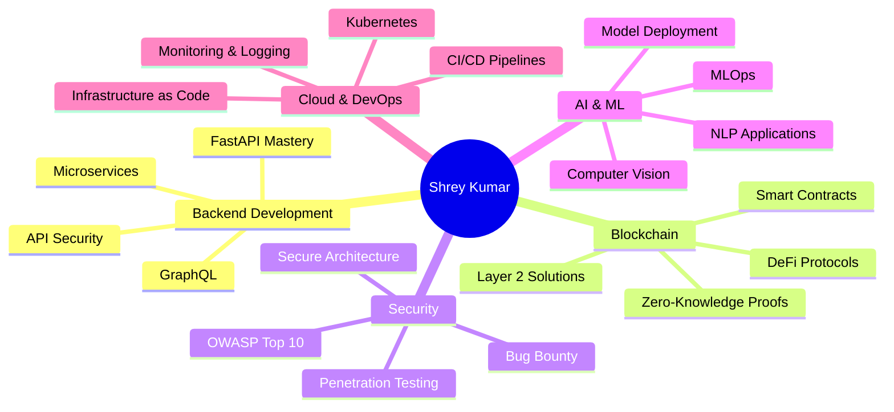

# Hey there, I'm Shrey Kumar 👋

<div align="center">
  
  

  

</div>

---

## 🚀 About Me


```python
class ShreyKumar:
    def __init__(self):
        self.role = "Engineering Student → Full-Stack Developer"
        self.location = "India 🇮🇳"
        self.current_focus = [
            "Building production-ready backends",
            "Exploring Web3 & smart contracts",
            "Cloud infrastructure & DevOps",
            "Cybersecurity & ethical hacking"
        ]
        self.interests = {
            "blockchain": ["Ethereum", "Solidity", "DeFi"],
            "backend": ["FastAPI", "Node.js", "Supabase"],
            "ai_ml": ["Risk Analysis", "NLP", "Computer Vision"],
            "security": ["Penetration Testing", "Secure Architecture"],
            "cloud": ["Deployment", "Scaling", "Infrastructure"]
        }
        self.learning = "Everything I can get my hands on 🔥"
        self.motto = "Security first, innovation always"
    
    def say_hi(self):
        print("Let's build something cool together!")
    
    def current_status(self):
        return {
            "coding": "Always ✅",
            "learning": "Non-stop 🚀",
            "coffee": "Required ☕",
            "bugs": "Hunting them down 🐛"
        }

shrey = ShreyKumar()
shrey.say_hi()
```

<br clear="right"/>

---

## 🛠️ Tech Arsenal

<div align="center">

### 💻 Languages & Core Technologies


### 🔧 Backend & Databases


### ⛓️ Blockchain & Web3


### 🤖 AI & Machine Learning


### ☁️ Cloud & DevOps


### 🔐 Security & Pentesting Tools


</div>

---

## 🎯 Featured Projects

<div align="center">

### 🏗️ **Major Builds That I'm Proud Of**

</div>

<table>
<tr>
<td width="50%">

### 🔍 [IRIS - Intelligent Risk Insight System](https://github.com/Shrey-Arc/IRIS-Backend)


**AI-powered credit risk analysis with blockchain verification**

- 🤖 ML-based risk scoring & compliance checking
- ⛓️ Ethereum Sepolia blockchain anchoring
- 📊 Automated PDF document processing
- 🔐 Secure authentication with Supabase

`FastAPI` `Python` `Solidity` `Supabase` `ML`

</td>
<td width="50%">

### 🛡️ [DhanRakshak - Financial Security Platform](https://github.com/Shrey-Arc/DhanRakshak)


**Protecting users from financial fraud & scams**

- 🚨 Real-time fraud detection & alerts
- 🔍 Transaction monitoring & anomaly detection
- 📱 Multi-platform security dashboard
- 🧠 ML-powered threat analysis

`Python` `Machine Learning` `Security APIs`

</td>
</tr>

<tr>
<td width="50%">

### 🎮 [AirTouchpad - Gesture Control System](https://github.com/Shrey-Arc/AirTouchpad)


**Control your computer with hand gestures**

- 👋 Real-time hand tracking & gesture recognition
- 🖱️ Virtual mouse & keyboard controls
- 📹 Camera-based input processing
- ⚡ Low-latency response system

`Python` `OpenCV` `MediaPipe` `Computer Vision`

</td>
<td width="50%">

### 🅿️ [ParkWise - Smart Parking Solution](https://github.com/Shrey-Arc/ParkWise)


**Intelligent parking management system**

- 🚗 Real-time parking spot detection
- 📊 Analytics & optimization algorithms
- 🗺️ Smart navigation to available spots
- 💡 IoT sensor integration

`IoT` `Computer Vision` `Backend APIs`

</td>
</tr>
</table>

---

## 📊 GitHub Analytics

<div align="center">
  
  
</div>

<div align="center">
  
  
</div>

---

## 🏆 Achievements & Trophies

<div align="center">
  
  

</div>

<div align="center">

### 🎯 Coding Stats


</div>

---

## 💡 Current Focus & Learning Path

<div align="center">



</div>

---

## 🔥 What I'm Currently Working On


<table>
<tr>
<td width="33%" valign="top">

### 📚 Learning
- Advanced smart contract security
- Cloud-native architecture patterns
- AI model deployment at scale
- Penetration testing methodologies
- Quantum-resistant cryptography

</td>
<td width="33%" valign="top">

### 🛠️ Building
- Decentralized finance protocols
- AI-powered security tools
- Scalable microservices architecture
- Web3 authentication systems
- Automated trading bots

</td>
<td width="33%" valign="top">

### 🔍 Exploring
- Zero-knowledge proofs
- Edge computing & IoT security
- Cross-chain interoperability
- Serverless architectures
- Web Assembly (WASM)

</td>
</tr>
</table>

---

## 🎓 Skills & Expertise Matrix

<div align="center">

| Domain | Skills | Proficiency |
|--------|--------|-------------|
| **Backend Development** | REST APIs • GraphQL • Microservices • Database Design |  |
| **Blockchain** | Smart Contracts • DApps • Web3 Integration • Testnet Deployment |  |
| **AI & ML** | NLP • Computer Vision • Risk Modeling • Model Deployment |  |
| **Cybersecurity** | Penetration Testing • Network Security • Ethical Hacking • OWASP |  |
| **Cloud & DevOps** | CI/CD • Docker • Cloud Deployment • Infrastructure as Code |  |

</div>

---

## 🌐 Connect & Collaborate

<div align="center">

[](mailto:Shrey_Kumar@outlook.com)
[](https://app.ens.domains/shrey.eth)
[](https://github.com/Shrey-Arc)
[](#)
[](#)


### 🚀 Open to Collaborations On:

🔐 **Security-focused projects** • ⛓️ **Blockchain & DeFi applications** • 🤖 **AI/ML implementations**

☁️ **Cloud-native solutions** • 🌐 **Full-stack applications** • 🎮 **CTF challenges**

</div>

---

## 🎯 Developer Philosophy

<div align="center">

<table>
<tr>
<td align="center" width="33%">


### 🛡️ Security First
*Think like an attacker,*
*build like a defender*

</td>
<td align="center" width="33%">


### 🚀 Innovation Always
*Push boundaries,*
*break conventions*

</td>
<td align="center" width="33%">


### 📚 Learn Forever
*Curiosity drives*
*excellence*

</td>
</tr>
</table>

</div>

---

## 🎮 When I'm Not Coding...

```javascript
const shreyOffDuty = {
  learning: {
    technical: ['Security blogs', 'Tech talks', 'Documentation deep-dives'],
    practical: ['CTF challenges', 'Bug bounty hunting', 'Open source contributions']
  },
  interests: {
    blockchain: 'Following DeFi protocols and Web3 innovations',
    ai: 'Experimenting with latest ML models',
    security: 'Studying attack vectors and defense strategies'
  },
  philosophy: {
    approach: 'Break things to understand them',
    method: 'Fix things I broke',
    outcome: 'Learn and repeat 🔄'
  },
  funFact: 'I consider 3 AM debugging sessions as meditation 🧘‍♂️'
};

console.log('Life = Code + Coffee + Curiosity ☕💻🔍');
```

---

## 💭 Random Dev Wisdom

<div align="center">
  
  

</div>

---

## 🎨 Code in Style

<div align="center">

```python
# My approach to problem-solving
def solve_problem(challenge):
    while not solved:
        try:
            solution = analyze(challenge)
            implement(solution)
            test(solution)
            if works:
                celebrate() 🎉
                document()
                return success
        except Error as e:
            learn_from(e)
            coffee_break() ☕
            try_different_approach()
    
    return "Never give up! 💪"
```

</div>

---

## 🏅 Badges of Honor

<div align="center">


</div>

---

<div align="center">

### 💬 "Talk is cheap. Show me the code." - Linus Torvalds


### ⭐ Star my repos if you find them interesting!

**Building secure, scalable, and decentralized systems • One commit at a time 🚀**


### 🌟 Let's Connect and Build the Future Together!

</div>

---

<div align="center">
  
</div>
