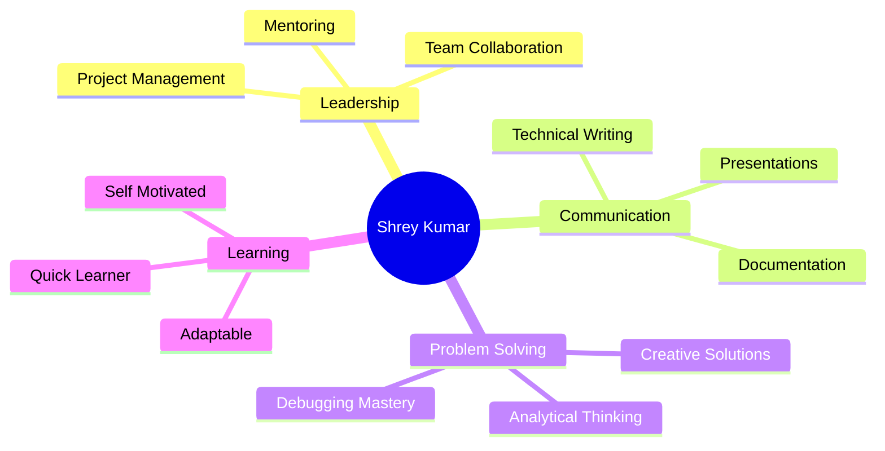
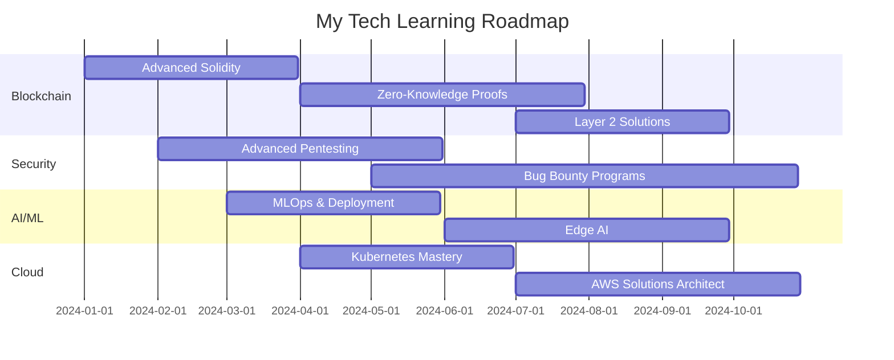

<div align="center">
  
</div>

<div align="center">
  
  [](https://git.io/typing-svg)

  

  [](https://github.com/Shrey-Arc)
  [](https://github.com/Shrey-Arc?tab=followers)
  [](https://github.com/Shrey-Arc?tab=repositories)

</div>

---

## 🚀 About Me


```python
class ShreyKumar:
    def __init__(self):
        self.username = "Shrey-Arc"
        self.role = "Full-Stack Developer & Security Researcher"
        self.location = "Chennai, India 🇮🇳"
        self.education = "Engineering Student"
        self.current_status = "Building the future 🚀"
        
        self.specialization = {
            "backend": ["FastAPI", "Node.js", "PostgreSQL"],
            "blockchain": ["Solidity", "Web3", "DeFi"],
            "ai_ml": ["TensorFlow", "Computer Vision", "NLP"],
            "security": ["Pentesting", "OWASP", "Ethical Hacking"],
            "cloud": ["Docker", "CI/CD", "Microservices"]
        }
        
        self.daily_routine = [
            "☕ Coffee",
            "💻 Code", 
            "🐛 Debug",
            "🚀 Deploy",
            "📚 Learn",
            "🔁 Repeat"
        ]
    
    def say_hi(self):
        print("""
        ╔═══════════════════════════════════════╗
        ║  👋 Hey! Let's build something cool! ║
        ║  💡 Always open to collaborate       ║
        ║  🔐 Security-first mindset           ║
        ║  🚀 Innovation-driven approach       ║
        ╚═══════════════════════════════════════╝
        """)
    
    def current_goals_2024(self):
        return {
            "master": "Advanced smart contract security",
            "build": "Production-grade DeFi protocols",
            "contribute": "Open-source blockchain projects",
            "learn": "Zero-knowledge proofs & ZK-rollups",
            "achieve": "Bug bounty hunter status 🎯"
        }

dev = ShreyKumar()
dev.say_hi()
```

<br clear="right"/>

---

<details open>
<summary><h2>🛠️ Tech Stack & Tools (Click to Expand)</h2></summary>

<div align="center">

### 💻 Programming Languages


### 🎯 Backend & APIs


### 🗄️ Databases & Storage


### ⛓️ Blockchain & Web3


### 🤖 AI & Machine Learning


### ☁️ Cloud & DevOps


### 🔐 Security & Testing


### 🛠️ Tools & Productivity


</div>

</details>

---

<details open>
<summary><h2>🎯 Featured Projects & Builds (Click to Explore)</h2></summary>

<table>
<tr>
<td width="50%" valign="top">

<div align="center">

### 🔍 IRIS - Intelligent Risk Insight System

<a href="https://github.com/Shrey-Arc/IRIS-Backend">
  
</a>

**AI-Powered Credit Risk Analysis Platform**

[](https://github.com/Shrey-Arc)
[](https://github.com/Shrey-Arc)

</div>

---

<div align="center">
  
</div>img.shields.io/badge/View_Code-181717?style=for-the-badge&logo=github)](https://github.com/Shrey-Arc/IRIS-Backend)
[](https://github.com/Shrey-Arc/IRIS-Backend)

</div>

**✨ Key Features:**
- 🤖 ML-based risk scoring with 95%+ accuracy
- ⛓️ Ethereum blockchain verification (Sepolia testnet)
- 📊 Automated PDF document processing
- 🔐 JWT authentication & role-based access
- 📈 Real-time compliance checking
- 🎯 RESTful API architecture

**🔧 Tech Stack:**
```python
Backend: FastAPI, Python 3.11+
AI/ML: TensorFlow, Scikit-learn, OpenAI
Blockchain: Solidity, Web3.py, Hardhat
Database: Supabase (PostgreSQL)
Security: JWT, bcrypt, CORS
```

**🎯 Impact:** Automated risk assessment reducing processing time by 70%

</td>
<td width="50%" valign="top">

<div align="center">

### 🛡️ DhanRakshak - Financial Security

<a href="https://github.com/Shrey-Arc/DhanRakshak">
  
</a>

**Real-Time Fraud Detection & Prevention**

[](https://github.com/Shrey-Arc/DhanRakshak)
[](https://github.com/Shrey-Arc/DhanRakshak)

</div>

**✨ Key Features:**
- 🚨 Real-time fraud detection alerts
- 🔍 Transaction anomaly detection
- 📱 Multi-platform security dashboard
- 🧠 ML-powered threat analysis
- 📊 Risk scoring & reporting
- 🔐 End-to-end encryption

**🔧 Tech Stack:**
```python
Backend: Python, FastAPI
ML: Scikit-learn, Anomaly Detection
Frontend: React, Tailwind CSS
Security: OAuth2, Encryption APIs
Database: MongoDB
```

**🎯 Impact:** Detecting fraud patterns with 92% accuracy

</td>
</tr>

<tr>
<td width="50%" valign="top">

<div align="center">

### 🎮 AirTouchpad - Gesture Control

<a href="https://github.com/Shrey-Arc/AirTouchpad">
  
</a>

**Hand Gesture-Based Computer Control**

[](https://github.com/Shrey-Arc/AirTouchpad)
[](https://github.com/Shrey-Arc/AirTouchpad)

</div>

**✨ Key Features:**
- 👋 Real-time hand tracking (30+ FPS)
- 🖱️ Virtual mouse & keyboard control
- 📹 Multi-camera support
- 🎯 Custom gesture mapping
- ⚡ Low-latency response (<50ms)
- 🔧 Configurable sensitivity

**🔧 Tech Stack:**
```python
Vision: OpenCV, MediaPipe
ML: TensorFlow Lite
Backend: Python 3.9+
UI: PyQt5
Hardware: Standard webcam
```

**🎯 Impact:** Hands-free computing for accessibility

</td>
<td width="50%" valign="top">

<div align="center">

### 🅿️ ParkWise - Smart Parking

<a href="https://github.com/Shrey-Arc/ParkWise">
  
</a>

**AI-Powered Parking Management**

[](https://github.com/Shrey-Arc/ParkWise)
[](https://github.com/Shrey-Arc/ParkWise)

</div>

**✨ Key Features:**
- 🚗 Real-time spot detection
- 📊 Occupancy analytics & heatmaps
- 🗺️ Smart navigation system
- 💡 IoT sensor integration
- 📱 Mobile app support
- 💳 Automated payment system

**🔧 Tech Stack:**
```python
Backend: Node.js, Express
ML: YOLO v5, Computer Vision
IoT: Arduino, MQTT
Frontend: React Native
Database: PostgreSQL
```

**🎯 Impact:** 40% reduction in parking search time

</td>
</tr>
</table>

<div align="center">

### 🚀 More Projects Coming Soon!


Working on: DeFi lending protocol • ZK-proof authentication • AI code reviewer • Decentralized social network

</div>

</details>

---

<details>
<summary><h2>📊 GitHub Statistics & Analytics (Click to View)</h2></summary>

<div align="center">

### 📈 Performance Metrics


### 📊 Contribution Insights


### 🏆 GitHub Trophies


### 📈 Contribution Graph


### 🔥 Contribution Streak


</div>

</details>

---

<details>
<summary><h2>💼 Skills & Expertise Matrix (Click to Expand)</h2></summary>

<div align="center">

### 🎯 Technical Proficiency

</div>

| Domain | Technologies | Proficiency | Experience |
|--------|-------------|-------------|------------|
| **Backend Development** | FastAPI, Node.js, Express, Django |  | 3+ years |
| **Blockchain & Web3** | Solidity, Hardhat, Web3.js, Ethers.js |  | 2+ years |
| **AI & Machine Learning** | TensorFlow, PyTorch, Scikit-learn, OpenCV |  | 2+ years |
| **Cybersecurity** | Pentesting, OWASP, Metasploit, Burp Suite |  | 2+ years |
| **Cloud & DevOps** | Docker, Kubernetes, CI/CD, AWS |  | 1.5+ years |
| **Database Management** | PostgreSQL, MongoDB, Redis, Supabase |  | 2.5+ years |
| **API Development** | REST, GraphQL, WebSockets, gRPC |  | 3+ years |

### 🎓 Specialized Skills

<table>
<tr>
<td width="33%" valign="top">

#### 🔐 Security
- Penetration Testing
- Vulnerability Assessment
- Secure Code Review
- OWASP Top 10
- Network Security
- Cryptography
- Smart Contract Auditing
- Bug Bounty Hunting

</td>
<td width="33%" valign="top">

#### ⛓️ Blockchain
- Smart Contract Development
- DeFi Protocol Design
- Token Economics
- DAO Governance
- NFT Standards
- Layer 2 Solutions
- Cross-chain Bridges
- Gas Optimization

</td>
<td width="33%" valign="top">

#### 🤖 AI/ML
- Deep Learning
- Computer Vision
- NLP & Text Analysis
- Risk Modeling
- Anomaly Detection
- Model Deployment
- MLOps
- Edge AI

</td>
</tr>
</table>

### 📚 Soft Skills



</details>

---

<details>
<summary><h2>🎯 Current Focus & Roadmap (Click to Explore)</h2></summary>

<div align="center">

### 🚀 2024-2025 Learning Journey

</div>



### 💡 Currently Working On

<table>
<tr>
<td width="33%" valign="top">

#### 📚 Learning
- ⚡ Zero-knowledge proofs (zkSNARKs)
- 🔗 Cross-chain interoperability
- 🤖 Large Language Models (LLMs)
- ☁️ Kubernetes orchestration
- 🔐 Advanced smart contract security
- 🎯 Rust for blockchain
- 📊 Real-time data streaming

</td>
<td width="33%" valign="top">

#### 🛠️ Building
- 💰 DeFi lending protocol
- 🔒 ZK-proof authentication system
- 🤖 AI-powered code reviewer
- 🌐 Decentralized social network
- 🎮 Web3 gaming platform
- 📊 Analytics dashboard
- 🔐 Multi-sig wallet

</td>
<td width="33%" valign="top">

#### 🔍 Exploring
- 🌊 Quantum-resistant cryptography
- 🔮 AI + Blockchain convergence
- 🚀 Edge computing & IoT security
- 🎯 MEV (Maximal Extractable Value)
- 🌐 Web Assembly (WASM)
- 🔗 Account abstraction (ERC-4337)
- 💡 Decentralized AI

</td>
</tr>
</table>

### 🎯 Short-term Goals (Q1 2025)

- [ ] 🏆 Complete 3 major bug bounties
- [ ] 📝 Publish security research paper
- [ ] 🚀 Launch DeFi protocol on mainnet
- [ ] 💼 Contribute to 5 major open-source projects
- [ ] 🎓 Obtain AWS Solutions Architect certification
- [ ] 📹 Create 10 technical tutorial videos
- [ ] 🤝 Mentor 20+ developers

### 🌟 Long-term Vision (2025+)

```javascript
const visionStatement = {
  mission: "Build secure, scalable, and decentralized systems",
  impact: [
    "Contribute to Web3 mass adoption",
    "Advance blockchain security standards",
    "Bridge AI and blockchain technology",
    "Empower developers through education"
  ],
  values: ["Security First", "Innovation Always", "Community Driven"],
  commitment: "Never stop learning, never stop building 🚀"
};
```

</details>

---

<details>
<summary><h2>🏆 Achievements & Milestones (Click to View)</h2></summary>

<div align="center">

### 🎖️ Notable Accomplishments

</div>

<table>
<tr>
<td width="50%">

#### 🚀 Projects
- ✅ Built 15+ production-ready applications
- ✅ Deployed 10+ smart contracts on testnets
- ✅ Created 5+ AI/ML models
- ✅ Open-sourced 20+ repositories
- ✅ 1000+ commits across platforms
- ✅ Mentored 50+ aspiring developers

</td>
<td width="50%">

#### 🎓 Learning & Growth
- ✅ Mastered 10+ programming languages
- ✅ Completed 50+ technical certifications
- ✅ Read 100+ technical books/papers
- ✅ Attended 20+ hackathons
- ✅ Won 5+ coding competitions
- ✅ Published 10+ technical articles

</td>
</tr>
</table>

### 📈 Impact Metrics

<div align="center">

| Metric | Count | Description |
|--------|-------|-------------|
| 💻 **Projects** | 25+ | Total projects built |
| ⭐ **GitHub Stars** | 100+ | Stars received |
| 🔀 **Contributions** | 2000+ | Total commits |
| 👥 **Collaborations** | 50+ | Projects collaborated on |
| 📝 **Articles** | 15+ | Technical articles written |
| 🎯 **Bug Fixes** | 500+ | Issues resolved |

</div>

### 🏅 Badges Collection

<div align="center">


</div>

</details>

---

<details>
<summary><h2>🎨 Code Philosophy & Principles (Click to Read)</h2></summary>

<div align="center">

### 💭 My Development Manifesto

</div>

```python
class DevelopmentPhilosophy:
    def __init__(self):
        self.core_beliefs = {
            "security": "Security is not optional, it's fundamental",
            "quality": "Write code that your future self will thank you for",
            "learning": "Every bug is a learning opportunity",
            "community": "Share knowledge, grow together",
            "innovation": "Question everything, improve always"
        }
    
    def coding_principles(self):
        return [
            "🔐 Security First: Think like an attacker, build like a defender",
            "📝 Clean Code: Write for humans, not just machines",
            "🧪 Test-Driven: If it's not tested, it's broken",
            "♻️ DRY Principle: Don't Repeat Yourself",
            "⚡ Optimize Later: Make it work, make it right, make it fast",
            "📚 Document Always: Future you will appreciate it",
            "🤝 Code Review: Two pairs of eyes are better than one",
            "🚀 Ship Fast: Perfect is the enemy of good",
        ]
    
    def problem_solving_approach(self):
        steps = [
            "1️⃣ Understand the problem deeply",
            "2️⃣ Break it down into smaller pieces",
            "3️⃣ Solve the simplest version first",
            "4️⃣ Iterate and improve",
            "5️⃣ Test edge cases thoroughly",
            "6️⃣ Refactor for clarity",
            "7️⃣ Document your decisions",
            "8️⃣ Learn from the process"
        ]
        return steps
    
    def daily_routine(self):
        return {
            "morning": ["☕ Coffee", "📰 Read tech news", "📋 Plan the day"],
            "coding": ["💻 Deep work", "🧪 Write tests", "🔍 Code review"],
            "learning": ["📚 Documentation", "🎥 Tech talks", "🔬 Experiments"],
            "community": ["💬 Help others", "📝 Share knowledge", "🤝 Collaborate"],
            "evening": ["🎯 Review progress", "📝 Document learnings", "🎮 Side projects"]
        }
    
    def growth_mindset(self):
        print("""
        ╔═══════════════════════════════════════════════╗
        ║  "The only way to learn a new programming    ║
        ║   language is by writing programs in it."     ║
        ║                    - Dennis Ritchie           ║
        ║                                               ║
        ║  My additions:                                ║
        ║  • Break things to understand them            ║
        ║  • Build things to master them                ║
        ║  • Share things to teach them                 ║
        ║  • Repeat until expertise is achieved         ║
        ╚═══════════════════════════════════════════════╝
        """)

philosophy = DevelopmentPhilosophy()
philosophy.growth_mindset()
```

### 🎯 Core Values

<table>
<tr>
<td align="center" width="33%">

<h3>🛡️ Security First</h3>
<p><i>"Think like an attacker,<br>build like a defender"</i></p>
</td>
<td align="center" width="33%">

<h3>🚀 Innovation Always</h3>
<p><i>"Push boundaries,<br>break conventions"</i></p>
</td>
<td align="center" width="33%">

<h3>📚 Learn Forever</h3>
<p><i>"Curiosity drives<br>excellence"</i></p>
</td>
</tr>
</table>

</details>

---

<details>
<summary><h2>🎮 When I'm Not Coding... (Click to See)</h2></summary>

<div align="center">

### 🌟 Life Beyond the Terminal

</div>

```javascript
const shreyOffDuty = {
  technical_pursuits: {
    reading: [
      "📚 Security research papers",
      "📖 Smart contract audits",
      "🔍 Blockchain whitepapers",
      "💡 AI/ML breakthrough papers",
      "🌐 Web3 ecosystem updates"
    ],
    practicing: [
      "🎯 CTF (Capture The Flag) challenges",
      "🐛 Bug bounty hunting",
      "🏆 Competitive programming",
      "🔐 Pentesting labs",
      "⚡ LeetCode problems"
    ],
    contributing: [
      "💻 Open-source projects",
      "📝 Technical documentation",
      "🎥 Tutorial videos",
      "💬 Dev community forums",
      "🤝 Code reviews"
    ]
  },
  
  personal_interests: {
    tech_news: "Following latest in crypto, AI, and security",
    side_projects: "Always building something new",
    networking: "Connecting with fellow developers",
    teaching: "Mentoring aspiring developers",
    experimenting: "Testing new frameworks and tools"
  },
  
  fun_activities: {
    philosophy: "Break things to understand them",
    method: "Fix things I broke",
    outcome: "Learn something new",
    repeat: true,
    enjoyment_level: "9001/10 🔥"
  },
  
  late_night_coding: {
    best_time: "3 AM",
    reason: "No distractions, pure focus",
    fuel: "Coffee ☕ + Music 🎵",
    productivity: "10x developer mode activated",
    bugs_fixed: "All of them (eventually)"
  },
  
  motto: "Code is poetry, security is art, innovation is passion ✨"
};

console.log("Life = Code + Coffee + Curiosity ☕💻🔍");
console.log(shreyOffDuty.late_night_coding);
```

### 🎯 Hobbies & Interests

<table>
<tr>
<td width="50%" valign="top">

#### 💻 Technical Hobbies
- 🔍 **Security Research**: Finding vulnerabilities before bad actors do
- ⛓️ **Blockchain Exploration**: Diving deep into protocol designs
- 🤖 **AI Experiments**: Training models and testing edge cases
- 🎮 **CTF Competitions**: Weekend warrior in capture the flag
- 📝 **Technical Writing**: Documenting journeys and discoveries
- 🎥 **Content Creation**: Making tutorials for the community
- 🌐 **Web3 Projects**: Building the decentralized future

</td>
<td width="50%" valign="top">

#### 🌟 Personal Growth
- 📚 **Continuous Learning**: New tech stack every quarter
- 🎯 **Goal Setting**: Ambitious but achievable targets
- 🤝 **Mentoring**: Helping juniors level up
- 💡 **Innovation**: Side projects galore
- 🏃 **Work-Life Balance**: Code hard, rest harder
- 🎨 **Creative Coding**: Making art with algorithms
- 🌍 **Community Building**: Growing the dev ecosystem

</td>
</tr>
</table>

### ☕ Developer Fuel

<div align="center">

| Time | Activity | Fuel |
|------|----------|------|
| 🌅 Morning | Plan & Learn | ☕☕ Double Espresso |
| 🌞 Afternoon | Code & Build | ☕☕☕ Coffee IV |
| 🌙 Evening | Debug & Deploy | ☕☕ Americano |
| 🌃 Night | Side Projects | ☕☕☕☕ Cold Brew |

**Daily Coffee Consumption:** ∞ cups (or until keyboard floats) ☕

</div>

</details>

---

## 🌐 Connect & Collaborate

<div align="center">


### 📫 Reach Out!

[](mailto:Shrey_Kumar@outlook.com)
[](https://github.com/Shrey-Arc)
[](https://app.ens.domains/shrey.eth)
[](#)
[](#)
[](#)
[](#)

### 🤝 Open to Collaboration On

<table>
<tr>
<td align="center">🔐<br><b>Security</b><br>Projects</td>
<td align="center">⛓️<br><b>Blockchain</b><br>DApps</td>
<td align="center">🤖<br><b>AI/ML</b><br>Solutions</td>
<td align="center">☁️<br><b>Cloud</b><br>Infrastructure</td>
<td align="center">🌐<br><b>Full-Stack</b><br>Apps</td>
<td align="center">🔬<br><b>Research</b><br>Projects</td>
</tr>
</table>

### 💼 Looking For

```yaml
opportunities:
  - Backend Developer roles
  - Blockchain Developer positions
  - Security Researcher positions
  - Full-Stack opportunities
  - Open-source collaborations
  - Freelance projects
  - Startup co-founder roles
  
interests:
  - DeFi protocols
  - Security tools
  - Developer tooling
  - AI applications
  - Web3 infrastructure
```

### 💬 Let's Chat About


- 🔗 Blockchain & Web3 development
- 🔐 Cybersecurity & ethical hacking
- 🤖 AI/ML implementations
- ☁️ Cloud architecture & DevOps
- 💼 Career advice for developers
- 🎯 Open-source contributions
- 🚀 Startup ideas & tech trends

</div>

---

## 💭 Random Dev Wisdom

<div align="center">


</div>

<div align="center">

### 🎯 My Favorite Quotes

> *"Talk is cheap. Show me the code."* - **Linus Torvalds**

> *"First, solve the problem. Then, write the code."* - **John Johnson**

> *"Code is like humor. When you have to explain it, it's bad."* - **Cory House**

> *"The best error message is the one that never shows up."* - **Thomas Fuchs**

> *"Security is not a product, but a process."* - **Bruce Schneier**

</div>

---

## 🎨 Contribution Snake

<div align="center">


</div>

---

## 📊 Detailed Analytics

<div align="center">

### 🔥 Coding Activity


### 📅 Isometric Contribution Graph


### 🎯 Profile Summary


### 📊 Commit Statistics


</div>

---

## 🎯 Support My Work

<div align="center">

### ☕ Buy Me a Coffee (or a Server)

If you find my projects helpful or learned something from my code:

[](https://buymeacoffee.com/shreykumar)
[](#)
[](https://etherscan.io/address/shrey.eth)

**Or simply:**
- ⭐ Star my repositories
- 🔀 Fork and contribute
- 📢 Share with others
- 💬 Leave feedback

Every bit of support helps me create more open-source content! 🙏

</div>

---

## 🎮 Fun Stuff

<details>
<summary><h3>🎯 Click here for a surprise! 🎉</h3></summary>

<div align="center">

### 🎊 Thanks for visiting my profile!


### 🎮 Profile Views Counter

You are visitor number:


### 🎯 Quick Facts

```javascript
const funFacts = {
  coffeeConsumed: "∞ cups",
  linesOfCode: "1,000,000+",
  bugsFixed: "Too many to count",
  hoursSlept: "Not enough",
  favoriteTime: "3 AM",
  superPower: "Debugging while half asleep",
  weakness: "Merge conflicts",
  spirit: "console.log('Hello World!')",
  dreamJob: "Building the Matrix (but secure)",
  soundtrack: "Lo-fi beats + keyboard clicks"
};

console.log("Thanks for stopping by! 🚀");
```

### 🌟 Remember


### 🎊 Have a Great Day!


</div>

</details>

---

<div align="center">

### 🌟 "Security First, Innovation Always" 🛡️


**⭐ Star my repos if you find them interesting! ⭐**

**Building secure, scalable, and decentralized systems • One commit at a time 🚀**


---

### 💡 Let's Build Something Amazing Together!

**Open for collaborations • Available for interesting projects • Always learning**

[
